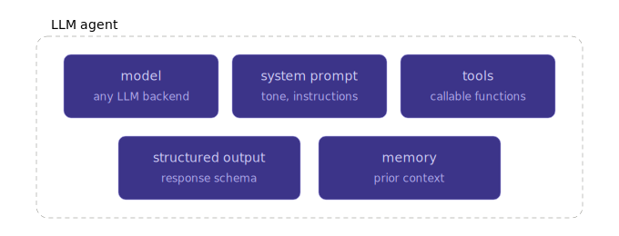
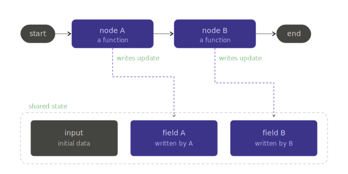
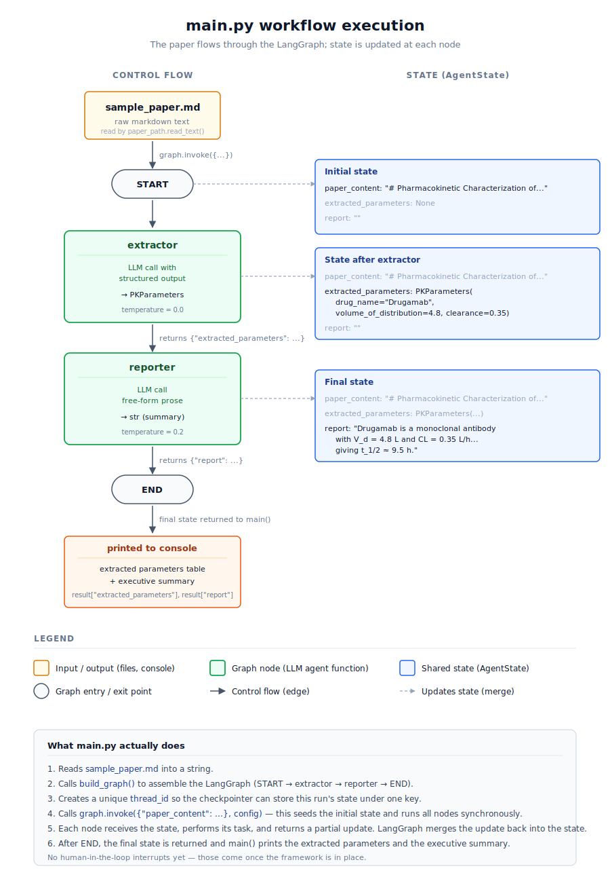
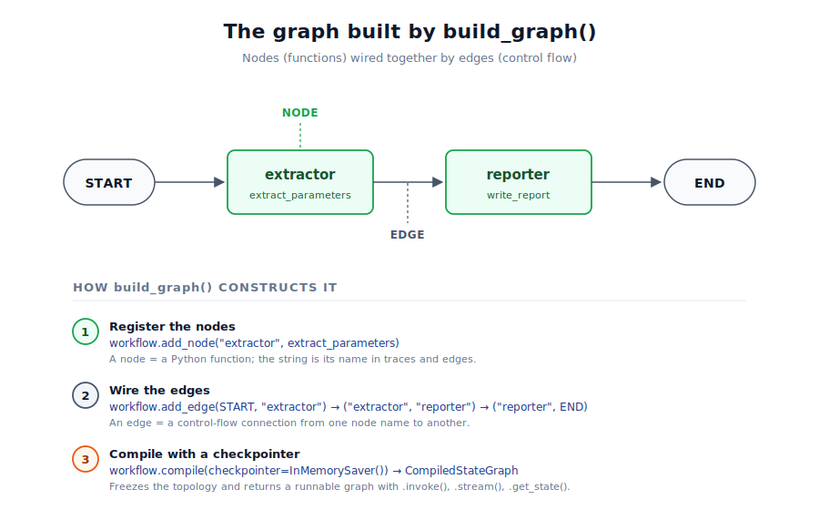

# Prologue

## Motivation

It is still unclear where exactly the ongoing revolution of Large Language Models (LLMs) is heading, but in 2026 I would say the buzzword "*agentic workflows*" is very common. While previously the public discussion was rather dominated by *copilots* and the simple use of *chatbots* from the browser window, it seems that it has shifted rather towards multi agent workflows, where multiple specialized agents jointly deal with a task.

In pharmacometrics we typically still need a human in the loop, and the whole reasoning and action steps need to be understandable post hoc. That is why a human in the loop (HITL) approach seems justified. I am still learning and by no means an expert. In a [previous blogpost](https://marian-klose.com/posts/command_line_chatgpt/) I talked about the simple concepts of a command line ChatGPT chatbot, and now I want to learn and explain to myself a more robust framework for what such a HITL agentic workflow in pharmacometrics could look like. 

::: {.callout-note}
## A note on how this was written
I get help from Claude and other LLM chatbots when writing posts like this one, so please don't treat it as solely my own piece of work. It's a blend of my own thoughts and reasoning with the collective written knowledge of the world, mixed in through LLM assistance. Fitting, perhaps, for a post about human-in-the-loop workflows.
:::

This blogpost is just me explaining things to myself, and for my own documentation I am wrapping it up in a blogpost. By sharing it online maybe it is also a help to others. But please expect mistakes and treat this post rather as my messy notes converted into a blogpost with the help of LLMs. In this first part my goal is to create a hello world example of two agents in Python that can later be easily adapted to have human approval, and that is robust enough to be extended to real world cases. But let us first dig into some fundamental understanding of LLM agents, multi agent workflows, and the specifics of pharmacometrics.


## What is an LLM-agent?

An LLM agent sounds quite fancy, but in the end it is simply the combination of:

1. **A specific model**, e.g. `openai::gpt-5.5`, `claude::sonnet-4.6`, or a locally run LLM like `llama`. This defines the capabilities of the agent, the cost, the speed, and maybe the area where the model is particularly strong.
2. **A set of system messages or instructions** that define the tone, the persona, and the task of the agent.
3. **A set of tools that the agent is able to call**, e.g. a web search or a personally defined Python function that runs locally on your computer.
4. **Potentially a structured output format** that defines how the LLM is answering.
5. **Memory or state**, if needed. It provides prior context.



A quick example for a parameter extraction agent that is able to extract NLME model parameters from a scientific publication and reports the parameters in a structured way:

1. `openai::gpt-5.5` as the LLM architecture.
2. System message: "*You are a pharmacometric expert that extracts parameter information in a structured way from a scientific publication*".
3. No additional tools are being handed to the agent.
4. We define a structured output format so that it gives back a structured and pre-defined `JSON` schema.
5. We can give it access to previously prompted scientific publications and their extracted parameters, so that it understands the history and expectations.

But before we dig into the codebase, let's assess some fundamental questions.


## What is a multi-agentic workflow?

As mentioned above, the current development seems to go rather in the direction of having many specialized LLM agents (specialized through model, system message tailored to the task, tools, structured output format, etc.) than having one single agent that is capable of doing everything. That is how the idea of multi agent workflows evolved. A complex task is prompted to an orchestrator or supervisor agent, which then breaks it down into many subtasks that are handed to the specialized agents, and in the end the orchestrator receives the outputs from all of them in order to fulfill the task.

There are also swarm approaches, where there is no real orchestrator or supervisor and the agents communicate freely among each other. These are often used for more creative tasks, but in well defined tasks the orchestrator approach seems to be dominating.


## What are the special challenges in pharmacometrics?

Vibe coding is nice, sure, and it is impressive how quickly you can generate code with simple natural language. But in pharmacometrics we cannot simply let a multi agent workflow perform an analysis without having any human in the loop. In the end we care about the output, the predicted AUC, Cmax, risk, or whatever numeric we are interested in. If we do not fully trust these numbers, then our analysis is useless. The decisions based on these numbers are simply too important to hand it all over to an agent.

The requirement is that a trained pharmacometric expert oversees the agents and is being asked for approval and oversight at critical steps, e.g. before running a NONMEM model or to validate that the extracted parameters are correct. The framework we are building today should be flexible enough to add these human in the loop breakpoints later.


## Which architecture to choose?

This is not a trivial question, and there are a couple of considerations for the architecture.

First of all: the field of LLMs is rapidly changing. That is why I would keep it model agnostic, so that providers can be easily switched. You do not want to build your codebase fully reliant on ChatGPT's API when in a couple of months Anthropic's Claude has a much better model, or when the API costs for the ChatGPT calls are getting too high.

I personally feel somewhat capable of writing Python code, so I would like to stick to Python. It is a flexible and powerful language, which is why I looked mainly for Python approaches.

The human in the loop approach needs to be implementable, which means that the architecture must be able to pause and wait for a human response. Some pharmacometric workflows also take a long time to finish. If at one point you want your agent to independently run NONMEM, then read the output, and then draft a report based on the outcome, the framework needs to handle long running tasks and orchestrate the agents properly.

Overall, I chose `LangGraph` for the main task of orchestrating and running the agents. After consulting with ChatGPT, Claude, and Gemini, this seems the best option for our use case. It is a rather complex framework with a bit of a steeper learning curve than the `pydantic ai` package I used in the [previous blogpost](https://marian-klose.com/posts/command_line_chatgpt/), but hopefully this investment will pay off later. It allows easy switching of providers, so we are not bound to a single one and can even use locally run LLMs if data protection and privacy reasons ask for it.

On top of this main architecture, we can implement a bunch of other packages to extend the approach later:

- **`pydantic` / `pydantic-settings`**: Used to define structured outputs, validate extracted pharmacometric parameters, and manage configuration. This is already part of the core architecture, because we want the LLM to return typed objects instead of free text.
- **`litellm`**: Useful if we want a more advanced model gateway later on. LiteLLM can help with provider independent model calls, fallback models, retries, load balancing, budget control, and cost tracking. For the hello world example this is not necessary yet, because LangChain already gives us enough model abstraction.
- **`fastapi` + `uvicorn`**: Useful if the workflow should later be exposed as a small API or web backend. This would allow a user interface or another service to start workflows, show intermediate results, and collect human approval.
- **`langgraph-checkpoint-postgres` + `psycopg`**: Useful for a more production like setup. A Postgres checkpointer would allow durable workflow state, resume after failure, long running tasks, and human in the loop pauses where the graph waits for expert approval before continuing.


## What is LangGraph

LangGraph (currently 32k GitHub stars) is a low level orchestration framework from the LangChain (currently 138k GitHub stars) team for building stateful LLM workflows. A stateful LLM workflow is a multi step AI process that remembers and uses earlier context, results, or decisions as it continues working.

With LangGraph, we model the application as a graph: nodes are functions (typically wrapping an LLM call), edges (the connections) define the control flow, and a shared state object (remember: stateful!) gets passed between them.

Unlike other frameworks, LangGraph supports cycles, which are essential for agent like behaviors where LLMs need to be called in loops. This matters the moment our workflow stops being linear, e.g. refining a NONMEM control stream until it converges.

Checkpointers (which save the workflow's state after each step) persist state between steps (in memory for prototyping, SQLite or Postgres for production). This is what unlocks the three features we actually care about in pharmacometrics: resume after failure for long running tasks, time travel debugging, and human in the loop interrupts where the graph pauses and waits for expert approval before continuing.

The trade off: there is genuine overhead. A plain script would do the job much more efficiently for two linear nodes, see my [previous blogpost](https://marian-klose.com/posts/command_line_chatgpt/). But the abstraction pays off the moment we need cycles, branching, persistence, or HITL, and bolting those onto a plain script later means rewriting everything.



The diagram shows it nicely. We have an entry point (start), and each node is essentially a function (mostly our specialized LLM agents that perform a task) that takes the shared state, performs a task, and then updates the state. The edges and connections define the flow, and the updated state is being handed over to the next node (which is again a function, again an LLM based chatbot). After all the work is done we have an endpoint and hopefully a good answer to our question or task.


## The hello world usecase

We now want to build up the hello world use case. To start simple and to set up the codebase, we will rely on two linear nodes (LLM agents). One extracts PK model parameters as structured output (JSON) and the other one takes the structured output and generates a high level summary of the parameters. We will not implement the human in the loop just yet. The goal for this blogpost is rather to set up the framework, explain it, and then later build upon it.

I will go through each file of the codebase, and try to explain to myself what it is doing and why we are designing it that way.


# Codebase

You can find the codebase for this repository in [my GitHub repo](https://github.com/marianklose/llm-agentic-workflow-sandbox). In the following, I will go through the key files and explain the design choices and the logic behind them. 

## Repository structure

Let me start by building up the codebase. Here is the structure of the current repository, in which I will add multiple examples. Currently we are dealing with the `01_hello_world` example, and later I will add more examples to it.


```{.bash filename="repo structure"}
llm-agentic-workflow-sandbox/
├── LICENSE
├── README.md
├── requirements.txt
└── 01_hello_world/
    ├── README.md
    ├── main.py
    ├── data/
    │   └── sample_paper.md
    └── src/
        └── pk_agent/
            ├── __init__.py
            ├── config.py
            ├── graph/
            │   ├── __init__.py
            │   └── builder.py
            ├── llm/
            │   ├── __init__.py
            │   └── provider.py
            ├── nodes/
            │   ├── __init__.py
            │   ├── extractor.py
            │   └── reporter.py
            ├── prompts/
            │   ├── __init__.py
            │   ├── extractor.py
            │   └── reporter.py
            └── schemas/
                ├── __init__.py
                ├── pk_model.py
                └── state.py
```

The repository has a single `requirements.txt` at the top level, meaning that one set of packages and package versions applies to all of our future example cases. The `01_hello_world` folder then contains the content of this specific example, and later there will be `02_xxx`, `03_xxx`, and so on. Inside this folder, `main.py` serves as our entry point, the file which gets everything started, while `data/` contains a dummy sample paper that we will use for our test case.

The `src/` directory is the **source root**, a conventional folder (the "src layout") whose only job is to hold our package one level down. It is not itself a package since there is no `__init__.py` in it. The actual top-level **package** is `src/pk_agent/`, and inside it `graph/`, `llm/`, `nodes/`, `prompts/`, and `schemas/` are **subpackages**, while files like `config.py` or `builder.py` are **modules**. Imports always start at the package, never at the source root: for example `from pk_agent.graph.builder import build_graph`. The `src` directory never appears in an import path.

For such a simple example, we could have put everything into a single `main.py` file and been done with it. But this package structure and the separation of input, source files, prompts, graphs, and so on keeps things maintainable and easily adjustable later on. Using **packages and subpackages** groups related code under a single namespace (`pk_agent.nodes`, `pk_agent.prompts`, …), so the directory tree itself documents what lives where, and imports read like a table of contents. Splitting into **modules** (one `.py` per concern: the LLM provider, the state schema, each node) gives every responsibility exactly one home. Swapping the model, tweaking a prompt, or adding a node is then a one-file change with a predictable blast radius. This layout also mirrors how real LangChain and LangGraph projects are organized, so learning it on a toy example pays off the moment we scale to `02_xxx`, `03_xxx`, or hand the code to someone else.


## Entry point

Now we define the entry point, which is our `main.py`. It loads the content of our pharmacometric paper (from which we want to extract parameters) and starts the workflow. A lot of the functions will not make sense yet (e.g. what is `build_graph()` actually doing?), but we will tackle these later, and hopefully by then it makes more sense.


```{.python filename="01_hello_world/main.py"}
"""
Entry point: loads the paper and runs the workflow.
"""
import sys
import uuid
from pathlib import Path
from dotenv import load_dotenv

# make 'src' importable (sandbox convenience, later via pip install -e). 
HERE = Path(__file__).resolve().parent
sys.path.insert(0, str(HERE / "src"))

# load environment variables from the repo-root .env BEFORE importing modules
load_dotenv(HERE.parent / ".env")

# importing objects from our own modules inside the pk_agent package
# imports placed after sys.path / dotenv setup are intentional;
# noqa: E402 silences the linter about that.
from pk_agent.config import settings            # noqa: E402
from pk_agent.graph.builder import build_graph  # noqa: E402

# define the main logic
def main() -> None:
    # read the pmx paper containing prose and the parameter estimates
    paper_path = settings.data_dir / "sample_paper.md"
    paper_content = paper_path.read_text(encoding="utf-8")

    # build the graph (based on our own function)
    graph = build_graph()

    # create thread_id (checkpointer stores state under this key) for this run
    # later this might be a session or user id
    thread_id = str(uuid.uuid4())
    config = {"configurable": {"thread_id": thread_id}}

    # some user information
    print(f"=== Workflow started (thread_id={thread_id[:8]}...) ===\n")

    # run the graph, invoke() executes all nodes synchronously and returns the final state
    # for long-running flows, we can use stream() to receive intermediate updates.
    # we see that we have to pass the initial state to start the graph workflow
    # the intital state is based on our paper content and the config
    result = graph.invoke(
        {"paper_content": paper_content},
        config=config,
    )

    # pretty print the results
    # we see that the results are simply the final version of the updated state
    # langgraph nodes are always taking states and updating parts of the states
    params = result["extracted_parameters"]
    print("--- Extracted parameters ---")
    print(f"  Drug:        {params.drug_name}")
    print(f"  V_d:         {params.volume_of_distribution} L")
    print(f"  CL:          {params.clearance} L/h")
    print()
    print("--- Executive summary ---")
    print(result["report"])

# some special python syntax, prevents from executing the main pipeling, e.g.,
# when only the package is being loaded. only if we directly run the main file
# then it is also being executed
if __name__ == "__main__":
    main()
```

That already defines the key logic behind our agentic pharmacometric workflow. We first load our own objects from our self-defined packages, subpackages, and modules. We then construct the initial state by reading in the paper content together with the config. The initial state is then passed to the graph, which runs through the nodes, and the final state is reported as the result of that workflow. Here is a high-level graphical overview of `main.py`:




## Input data

The input data file is quite simple. We just have a made-up short version of a paper, containing prose and some hidden parameter estimate information within the prose.

```{.markdown filename="01_hello_world/data/sample_paper.md"}
# Pharmacokinetic Characterization of Drugamab in Healthy Volunteers

## Abstract
This study investigates the pharmacokinetic profile of Drugamab, a novel
monoclonal antibody indicated for the treatment of advanced inflammatory
conditions. We characterized its disposition following a single
intravenous bolus administration in 24 healthy adult volunteers.

## Methods
24 healthy volunteers received a single intravenous bolus of Drugamab
at 5 mg/kg. Blood samples were collected at predefined time points up
to 168 hours post-dose. Plasma concentrations were quantified using a
validated LC-MS/MS assay (LLOQ: 0.05 µg/mL).

## Results
Following intravenous administration, plasma concentrations of Drugamab
declined in a manner consistent with a one-compartment model with
first-order elimination.

The estimated apparent volume of distribution (V) was 4.8 L, suggesting
distribution primarily within the plasma and interstitial fluid
compartments. The total systemic clearance (CL) was estimated at
0.35 L/h, indicating slow elimination characteristic of monoclonal
antibody pharmacokinetics.

Additional secondary parameters, including the area under the curve
(AUC0-∞ = 71.4 µg·h/mL) and peak plasma concentration
(Cmax = 73.2 µg/mL), are reported in Table 1.

## Discussion
The observed pharmacokinetic parameters are consistent with values
reported for similar monoclonal antibodies.
```

## Package root

`pk_agent` is our package, and we need to tell Python that. By adding an `__init__.py` file into a folder, we tell Python "treat this folder as a package", which means it can later be imported by calling something like `from pk_agent.graph.builder import build_graph`. The file is often empty or just contains a docstring for documentation purposes.

```{.python filename="01_hello_world/src/pk_agent/__init__.py"}
"""
pk_agent: a minimal two-agent LangGraph workflow for pharmacokinetic
parameter extraction and reporting.
"""
```

## Configuration

There are some high-level configuration choices (like the model we want to use, in this case `anthropic:claude-sonnet-4-6`) that should better not be hard-coded everywhere but live in one central configuration file. This is exactly what we do with `config.py`. The settings defined in `config` also read in the `.env` variables, retrieving any API keys needed, and so on. Whatever is shared across multiple files should be coded in here instead of being hard-coded in the individual files.

```{.python filename="01_hello_world/src/pk_agent/config.py"}
"""
Central configuration for the package. Allows to populate its fields from
the environmental variables in .env, and to have a single source of truth for all other
settings. SettingsConfigDict tells Pydantic to look for .env three levels up from this file,
which is the project root.

Design split between this file and .env:
  - config.py holds *application behavior*: model choice, temperature,
    paths. These are design decisions, version-controlled, the same
    on every machine.
  - .env holds *machine-specific or secret values*: API keys. These
    are gitignored and vary per developer or environment.

If you find yourself wanting to vary something per machine that isn't
secret (e.g. you want to test a different model locally), promote it
to .env at that point. Until then, keep it here where it's visible.
"""
from pathlib import Path
from pydantic_settings import BaseSettings, SettingsConfigDict

# we define a pydantic settings model 
# special type that allows to populate fields from env variables and .env files
class Settings(BaseSettings):
    """Global application settings."""

    # defines LLM choice in "<provider>:<model>" format. init_chat_model
    # understands: anthropic, openai, google_genai, ollama, mistralai, ...
    llm_model: str = "anthropic:claude-sonnet-4-6"
    llm_temperature: float = 0.0

    # define secrets and machine-specific values, loaded from .env
    anthropic_api_key: str | None = None
    openai_api_key: str | None = None

    # compute path
    project_root: Path = Path(__file__).resolve().parents[2]
    data_dir: Path = project_root / "data"

    # tell pytdantic to also look into the .env file, read it as utf8, 
    # ignore unknown keys, and match variable names case-insensitively
    model_config = SettingsConfigDict(
        env_file=Path(__file__).resolve().parents[3] / ".env",
        env_file_encoding="utf-8",
        extra="ignore",
        case_sensitive=False,
    )

# reads the .env file, applies defaults and constructs a populated settings object
# we will later do   from pk_agent.config import settings  to use these values
settings = Settings()
```

## Graph

Now we start with the first proper subpackage, the graph subpackage we are building. The graph itself defines the workflow orchestration: it defines the nodes (the functions, workers, or agents) and the edges (the connections, or wires) between them. The package needs to answer which nodes exist, in what order they run, and how state moves between them. In our simple case, we want to define a graph which gives us:

```
START → extractor → reporter → END
```

### Package init

As always, we initialize this subpackage with an `__init__.py` file that contains a simple docstring.

```{.python filename="01_hello_world/src/pk_agent/graph/__init__.py"}
"""
LangGraph workflow construction.
A LangGraph is basically a flowchart with decision points.
We have the different nodes (= functions) and the edges between them (= control flow).
"""
```

### Builder

Now we define the graph builder module, the central piece of the graph subpackage which contains a factory function `build_graph()`. A factory function is a function whose main job is to create and return another object. `build_graph()` is a factory function because it constructs the LangGraph workflow and returns a ready-to-use compiled graph. In `main.py`, we have already seen that we first construct the graph and then invoke it with the initial state. The full path to this object is:

```
pk_agent                  package
└── graph                 subpackage
    └── builder.py        module
        └── build_graph   object (function)
```

```{.python filename="01_hello_world/src/pk_agent/graph/builder.py"}
"""
Graph builder: assembles the LangGraph workflow via a factory function.

We wrap construction in a factory function so that:
  1. Tests can build the graph with a mock or in-memory checkpointer
     and run it in isolation.
  2. The checkpointer (saving the state after each step) is a parameter, not hard-coded.
      Swapping InMemorySaver for SqliteSaver or PostgresSaver becomes a
     one-line change at the call site.
  3. main.py, a future FastAPI endpoint, and a Jupyter notebook can
     all share the same construction code.
"""
from langgraph.checkpoint.base import BaseCheckpointSaver
from langgraph.checkpoint.memory import InMemorySaver
from langgraph.graph import END, START, StateGraph
from ..nodes.extractor import extract_parameters
from ..nodes.reporter import write_report
from ..schemas.state import AgentState


# the main factory function that returns the compiled graph that can be invoked or streamed
def build_graph(checkpointer: BaseCheckpointSaver | None = None):
    """Build the workflow and return a runnable compiled graph.

    Args:
        checkpointer: Optional checkpointer instance. Defaults to
            InMemorySaver, which keeps state in process memory and is
            lost on restart. For production-style persistence, pass a
            SqliteSaver or PostgresSaver instance.

    Returns:
        A CompiledStateGraph exposing .invoke(), .stream(),
        .get_state(), and the rest of the LangGraph API.
    """
    # creating a graph skeleton while binding it to our define state schema
    # the pydantic class AgentState is defined in 01_hello_world/src/pk_agent/schemas/state.py
    workflow = StateGraph(AgentState)

    # we tell LangGraph that two nodes exist
    # the string names appear in LangSmith traces and errors, so they have
    # to be descriptive for later debugging
    workflow.add_node("extractor", extract_parameters)
    workflow.add_node("reporter", write_report)

    # now we are wiring the edges, we want to achieve:
    # START -> extractor -> reporter -> END
    # later, with conditional routing we can use add_conditional_edges()
    # here we have a simple linear workflow
    workflow.add_edge(START, "extractor")
    workflow.add_edge("extractor", "reporter")
    workflow.add_edge("reporter", END)

    # define the checkpointer, which defines where states are saved between steps
    # for our sandbox purpose, InMemorySaver() is sufficient. 
    # having a checkpointer enables later human-in-the-loop interrupts or resume-after-failure
    if checkpointer is None:
        checkpointer = InMemorySaver()

    # compile returns a runnable graph according to our config
    return workflow.compile(checkpointer=checkpointer)
```

To visualize the workflow again, we have our friend Claude draw it for us:



## LLM provider

As mentioned in the introduction, we want to be as model agnostic as possible. We want to easily switch between different providers and models. This is why we have a central LLM provider module, which defines a single function `get_llm()` that returns a configured LLM instance. It also allows us to later extend the framework with `litellm`, which can give us more advanced features like fallback routing, retries, cost tracking, and so on. If we want to add these features later, we can simply change the implementation of `get_llm()` without having to touch any of the nodes that call it. This is a key design principle: we want to have a single chokepoint for all LLM calls, so that we can easily manage and extend them later on.

### Package init

The regular package init file with a simple docstring.

```{.python filename="01_hello_world/src/pk_agent/llm/__init__.py"}
"""
LLM provider abstraction.
"""
```

### Provider

Now we define the provider, which is currently a very simple `get_llm()` function that is basically a wrapper around `init_chat_model()` from LangChain. It takes care of reading the model choice and temperature from the settings, and returns a configured LLM instance that can be used in the nodes. The advantage of having a single `get_llm()` function is that we can later add much more complex logic in this function without having to touch all the other files. Hard-coding it would make it much harder to maintain and extend later on.

```{.python filename="01_hello_world/src/pk_agent/llm/provider.py"}
"""
LLM provider abstraction.

Every LLM call in the project goes through get_llm(). The wrapper is
deliberately thin today, but it gives us a single chokepoint for
later additions: LiteLLM fallback routing, retry policies, request
logging, or a deterministic mock model for tests. Whatever changes,
the nodes that call get_llm() stay the same.

Allows us to use from ..llm.provider import get_llm and have this central
implementation injected at each node. Easy to change later instead of touching
hard-coded LLM calls in multiple places (harder to maintain). All nodes will use
llm = get_llm() after importing this package.
"""
from langchain.chat_models import init_chat_model
from langchain_core.language_models import BaseChatModel

from ..config import settings

# define the key function that returns a configured LLM instance, which can be used in the nodes
def get_llm(temperature: float | None = None) -> BaseChatModel:
    """Return a configured chat model.

    Args:
        temperature: Optional override for the default temperature
            from settings/config. Useful when one node needs deterministic
            output (temperature=0) while another wants a bit of
            variation for prose.

    Returns:
        A BaseChatModel instance with the standard LangChain interface:
        .invoke(), .stream(), .with_structured_output(), and so on.
    """

    # init_chat_model directly comes from langchain
    # can be later replaced with LiteLLM logic or pydantic-ai or 
    # whatever we want to use for model calls
    return init_chat_model(
        model=settings.llm_model,
        temperature=temperature if temperature is not None else settings.llm_temperature,
    )
```

## Nodes

The nodes are the workhorses in our workflow. This is where things actually happen and where the state gets updated. Each node is basically a function that takes some input, does something, and returns some output. In our case, the nodes take the state as input, run an LLM-agent, and return a dictionary of updates that is merged back into the state. In agentic workflows, nodes are often LLM-based agents that perform a specific task, e.g. extracting parameters, writing a report, or making a decision. But they can also be simple Python functions that do some data processing or calculations.

The key design principle for nodes is that they should be pure functions: they take the state as input and return a new state (or a dict of updates to the state) without mutating the input state directly. This makes them easy to test and reason about, and it also allows LangGraph to handle state merging and persistence in a consistent way.

### Package init

The regular package init file with a simple docstring.

```{.python filename="01_hello_world/src/pk_agent/nodes/__init__.py"}
"""
Workflow nodes: the units of work in the LangGraph graph.
Each node is basically a function that takes some input,
does something (e.g. calls an LLM), and returns some output.
In our case, the nodes take the sate as input and return a dict of updates to the state.
"""
```

### Extractor

Our first node is the extractor, which reads the paper content from the state and extracts the PK parameters from it. It uses the LLM to do this, and it returns the extracted parameters as a structured output (a Pydantic model) that gets merged back into the state. The updated state can later be passed to the next node.

Importantly, the node functions within a LangGraph workflow always take the state as input and then return a dictionary of updates. We do not have to take care of how these updates are merged back into the state, this is something that LangGraph handles for us.

Please note: in these node files (`01_hello_world/src/pk_agent/nodes/extractor.py`) we define one single function, like `extract_parameters()`. In the graph builder (`01_hello_world/src/pk_agent/graph/builder.py`) we then tell LangGraph that this function is a node in our workflow by calling `workflow.add_node("extractor", extract_parameters)`. So we explicitly link the function inside the file to the node name in the graph.

```{.python filename="01_hello_world/src/pk_agent/nodes/extractor.py"}
"""
Extractor node: extracts PK parameters from the paper text.

In LangGraph, a node is simply a function with the signature:
    state -> dict of updates

It receives the current state (a Pydantic instance) and returns a
dictionary containing only the fields it wants to update. LangGraph
handles merging the update back into the state.
"""
from langchain_core.messages import HumanMessage, SystemMessage
from ..llm.provider import get_llm
from ..prompts.extractor import EXTRACTOR_SYSTEM_PROMPT
from ..schemas.pk_model import PKParameters
from ..schemas.state import AgentState


# define key function for the extractor node
def extract_parameters(state: AgentState) -> dict:
    """Read state.paper_content and extract PK parameters from it."""

    # construct the llm instance, and tell it that we want structured output 
    # in the form of a PKParameters object
    # .with_structured_output(PKParameters) tells the LLM that its
    # response must conform to the PKParameters schema. LangChain
    # translates the schema into the provider's tool-calling format,
    # invokes the model, and parses the response back into a
    # PKParameters instance. Validation errors are raised here, not
    # silently passed downstream.
    llm = get_llm().with_structured_output(PKParameters)

    # invoke the model with the system prompt and the paper content as input
    # we can see that we are passing the paper content from the state as input
    # by passing a defined extractor system prompt, we can guide the model
    # to perform its task in the way we want it to (prompt engineering)
    response: PKParameters = llm.invoke(
        [
            SystemMessage(content=EXTRACTOR_SYSTEM_PROMPT),
            HumanMessage(content=state.paper_content),
        ]
    )

    # Return only the field we want to update. LangGraph merges this
    # with the existing state, we never mutate the input state object
    # directly. Treating nodes as pure functions makes them easy to
    # test and reason about.
    return {"extracted_parameters": response}
```

### Reporter

The same logic applies to the reporter agent, which takes the extracted parameters from the state and generates a short executive summary based on them. It also uses the LLM to do this, and it returns the generated report as a string that gets merged back into the state.

```{.python filename="01_hello_world/src/pk_agent/nodes/reporter.py"}
"""
Reporter node: produces a short executive summary.
"""
from langchain_core.messages import HumanMessage, SystemMessage
from ..llm.provider import get_llm
from ..prompts.reporter import REPORTER_SYSTEM_PROMPT
from ..schemas.state import AgentState

# define key function for the reporter node
def write_report(state: AgentState) -> dict:
    """Read state.extracted_parameters and write the executive summary."""

    # defensive check to ensure the extracted parameters are there
    if state.extracted_parameters is None:
        raise ValueError(
            "Reporter was invoked but extracted_parameters is None. "
            "Check the node order in graph/builder.py."
        )

    # extract parameters
    p = state.extracted_parameters

    # construct the user_message content based on the extracted parameters
    # which will be passed to the LLM as input
    user_content = (
        f"Please write the executive summary for the following model:\n"
        f"- Drug: {p.drug_name}\n"
        f"- Volume of distribution V: {p.volume_of_distribution} L\n"
        f"- Clearance CL: {p.clearance} L/h"
    )

    # get llm instance with slightly higher temperature
    llm = get_llm(temperature=0.2)

    # invoke the model with the system prompt and the user message as input
    response = llm.invoke(
        [
            SystemMessage(content=REPORTER_SYSTEM_PROMPT),
            HumanMessage(content=user_content),
        ]
    )

    # return dict with the updated field
    # which gets merged back into the state by LangGraph
    return {"report": response.content}
```

## Prompts

Prompts are an important piece in LLM-based workflows, and the buzzword "prompt engineering" reflects that. The way we ask the model to do something has a huge impact on the results we get back, so it is important to design good prompts. We did not invest a lot of time in our prompts in this case, but for this simple example they are sufficient. In a real use case, we would probably want to iterate on them a bit more, test different versions, and so on.

By putting the prompts into separate files, we can easily find and edit them later on without having to dig through the node code. It also keeps the node code cleaner and more focused on the logic, while the prompts are all in one place.

### Package init

The regular package init file with a simple docstring.


```{.python filename="01_hello_world/src/pk_agent/prompts/__init__.py"}
"""
System prompts / messages for the workflow's agents.
"""
```

### Extractor prompt

Now we define the system prompt for the extractor agent. It has to be clear and specific to guide the model to do what we want it to do. Later on, the `EXTRACTOR_SYSTEM_PROMPT` will be used when invoking the LLM in the extractor node (`01_hello_world/src/pk_agent/nodes/extractor.py`).

```{.python filename="01_hello_world/src/pk_agent/prompts/extractor.py"}
"""
System prompt for the extractor agent.
"""

EXTRACTOR_SYSTEM_PROMPT = """\
You are an experienced pharmacometrician. Your task is to extract the
pharmacokinetic parameters of a one-compartment IV model from a
scientific text.

Extract only:
- drug_name: the name of the drug under investigation
- volume_of_distribution: volume of distribution in liters (L)
- clearance: total systemic clearance in L/h

Important:
- If units differ from those required, convert them carefully.
  Examples: 1 mL/min = 0.06 L/h; 1000 mL = 1 L.
- Ignore AUC, Cmax, half-life, and any boilerplate text.
- Do not guess. If a parameter is ambiguous or absent, report the
  conflict rather than fabricating a value.
"""
```

### Reporter prompt

The same logic applies to the reporter prompt.

```{.python filename="01_hello_world/src/pk_agent/prompts/reporter.py"}
"""
System prompt for the reporter agent.
"""

REPORTER_SYSTEM_PROMPT = """\
You are a scientific writer in pharmacometrics. Produce a very short
executive summary of a one-compartment IV pharmacokinetic model.

Requirements:
- Maximum 4-5 sentences, prose only (no Markdown headings or bullets).
- Audience: clinical pharmacology reviewer.
- State the drug name, V_d, and clearance.
- Compute and report the elimination half-life as t_1/2 = ln(2) * V / CL.
- Do not speculate about efficacy, dosing, or safety.
"""
```


## Schemas

Schemas are the structured formats of the data that we use in our workflow, typically defined as Pydantic models. They serve as contracts for what the data should look like, both for the LLM agents and for the rest of the codebase. Having Pydantic models helps on the one hand to validate the data (e.g. ensuring that the volume of distribution is a positive number), and on the other hand to document the expected shape and meaning of the data (e.g. what fields are expected, what they mean, what units to use, and so on). This is especially important when working with LLMs, as it guides them to produce output in the correct format and with the correct content.

In our case, we have two main schemas: one for the PK parameters (the domain model) and one for the shared state that flows through the graph. The PK parameters schema defines what the extracted parameters should look like, while the state schema defines what data is available at each step of the workflow and how it can be updated.

### Package init

The regular package init file with a simple docstring.

```{.python filename="01_hello_world/src/pk_agent/schemas/__init__.py"}
"""
Pydantic data models for the workflow's domain and state.
Used to tell the LLM agents and the rest of the codebase
what the data looks like (return data like this) or (expect data like this).
Mainly pydantic classes that define the expected shape, types, and validation
rules for the data used in the workflow.
"""
```

### PK model

For the PK model, we define the `PKParameters` class, which has three fields: `drug_name`, `volume_of_distribution`, and `clearance`. Each field has a type, a description, and some validation rules (e.g. volume of distribution must be greater than 0).

Importantly, the LLM can read the description of the fields, so it can be treated as some kind of prompt engineering as well. By providing clear descriptions of what each field means and what units to use, we guide the model to produce output that conforms to our expectations without having to repeat the same instructions in the prompt every time.


```{.python filename="01_hello_world/src/pk_agent/schemas/pk_model.py"}
"""
Domain models: pharmacokinetic parameters. Basically, what
extracted PK parameters should look like.

A single Pydantic class serves three purposes at once:

  1. Structured-output contract: when an LLM is asked to produce a
     PKParameters object, LangChain translates this schema into the
     provider's tool-calling format, forcing the model to return
     conforming data.

  2. Validation: fields are checked against constraints (e.g. volume
     must be > 0). Bad LLM output raises an error here instead of
     silently corrupting downstream nodes.

  3. Documentation: each Field's description is included in the
     schema sent to the LLM, so the model understands what each
     parameter means without us repeating the explanation in the
     prompt.
"""
from pydantic import BaseModel, ConfigDict, Field

# define the PKParameters class (expected output of the extractor node)
class PKParameters(BaseModel):
    """PK parameters of a one-compartment IV model."""

    drug_name: str = Field(
        ...,
        description="Name of the investigated drug (INN or code name).",
    )
    volume_of_distribution: float = Field(
        ...,
        # has to be greater than 0 to be physiologically plausible.
        gt=0,
        # helps the model to understand what this parameter means and what units to use.
        description=(
            "Volume of distribution V in liters (L). If the source "
            "reports a different unit, convert to L before returning."
        ),
    )
    clearance: float = Field(
        ...,
        gt=0,
        description=(
            "Clearance CL in L/h. Convert other units if needed "
            "(1 mL/min = 0.06 L/h)."
        ),
    )

    # extra='forbid' rejects any unexpected fields. Catches typos and
    # hallucinated keys at the boundary instead of letting them through.
    model_config = ConfigDict(extra="forbid")
```

### State

The state is also an important schema, as it defines the shared data structure that flows through the graph. It contains all the information that the nodes can read from and write to. In our case, it has three fields: `paper_content`, `extracted_parameters`, and `report`. The first one is the raw text of the paper, the second one is the structured PK parameters extracted by the extractor node, and the third one is the executive summary generated by the reporter node.

```{.python filename="01_hello_world/src/pk_agent/schemas/state.py"}
"""
Graph state: the data pipeline between nodes. A shared whiteboard
that all nodes read from and (partially) write to.

Each node receives an AgentState instance as input and returns a
partial update (a dict containing only the fields it wants to change).
LangGraph merges that update back into the state, validates it
against this schema, and passes the new state to the next node.

Using a Pydantic BaseModel instead of TypedDict gives us:
  - validation on every state update;
  - explicit defaults via Field(default=...);
  - editor autocomplete and type-checking on state attributes.
"""
from typing import Optional
from pydantic import BaseModel, ConfigDict, Field
from .pk_model import PKParameters

# define the AgentState class, which is the shared state object for all nodes in the workflow
class AgentState(BaseModel):
    """Shared state object for all nodes in the workflow."""

    paper_content: str = Field(
        default="",
        description="Raw text of the input paper.",
    )
    extracted_parameters: Optional[PKParameters] = Field(
        default=None,
        description="PK parameters produced by the extractor node.",
    )
    report: str = Field(
        default="",
        description="Executive summary produced by the reporter node.",
    )

    # add extra='forbid' to catch any typos or unexpected fields in the state updates
    model_config = ConfigDict(extra="forbid")
```


# Running the agentic workflow

That was a looooot of code for a simple example, and as said, this could have been done in a much more concise way. But the more robust structure will surely pay off later on when we want to extend the workflow, add more nodes, add human-in-the-loop interactions, and so on. Now we should test the whole thing and see if it actually works.


## Setting up virtual environment and installing dependencies

The first thing we have to do is to set up a virtual environment and install any dependencies. The dependencies are hidden in the `requirements.txt` file, and here is the content:

```{.python filename="llm-agentic-workflow-sandbox/requirements.txt"}
langgraph>=0.6.0
langchain>=1.0.0
langchain-anthropic>=0.3.0
pydantic>=2.0.0
pydantic-settings>=2.0.0
python-dotenv>=1.0.0
```

We first change directory into the proper folder:

```bash
cd llm-agentic-workflow-sandbox
```

Then we create and activate a virtual environment (using `venv`, but you can also use `conda` or whatever you prefer):

```bash
python -m venv .venv
.venv\Scripts\activate
```

And finally, we install the dependencies:

```bash
pip install -r requirements.txt
```

This creates a fresh virtual environment with all the dependencies installed, and we can now run our code without worrying about conflicts with other projects or system-wide packages. We still need to define the API keys for the LLM provider of choice in the `.env` file:

```{.python filename="llm-agentic-workflow-sandbox/.env"}
# the anthropic API key, needed to use the claude-sonnet-4-6 model
ANTHROPIC_API_KEY=sk-xxxxx-xxxx-xx-xxxxxxxxxxxxxxx

# only needed if we switch providers to openai/chatgpt
# OPENAI_API_KEY=
```

## Executing the agentic workflow

With everything set up, we can now run the main file to execute the workflow:

```bash
python 01_hello_world/main.py
```

This gives us the following output:

```{.python filename="output"}
(.venv) PS C:\xxx\llm-agentic-workflow-sandbox> python 01_hello_world/main.py

=== Workflow started (thread_id=c69f3a80...) ===

--- Extracted parameters ---
  Drug:        Drugamab
  V_d:         4.8 L
  CL:          0.35 L/h

--- Executive summary ---
Drugamab was characterized by a one-compartment intravenous 
pharmacokinetic model with a volume of distribution (V_d) 
of 4.8 L and a systemic clearance (CL) of 0.35 L/h. 
The elimination half-life, calculated as t_1/2 = ln(2) × V_d / CL,
was approximately 9.5 hours. Concentration-time data following 
intravenous administration were adequately described by 
monoexponential decline consistent with linear, 
first-order elimination kinetics. These structural model 
parameters provide a quantitative basis for characterizing 
the disposition of Drugamab in the studied population.
```


Hurray, our first multi-agentic workflow with two independent nodes is running and producing results! It correctly extracted the NLME model parameters from the dummy paper content and then generated a short executive summary based on these parameters.

Since we use `graph.invoke()` in `main.py`, the workflow runs in a single go from start to end. If we wanted to have more control over the execution we could use `graph.stream()` instead, which gives us an iterator that yields the state after each node is executed. This way, we could inspect the state after the extractor node, ask a human to verify or correct the extracted parameters, and then pass the updated state to the reporter node. This is what will be covered in part 2, where we will add human-in-the-loop interactions to the workflow. For the first part, I am happy with this simple end-to-end example and call it a day. 

# Epilogue

This was a very simplified example, and we invested heavily into a solid and robust codebase in order to extend the framework later on. Now we have everything we need to easily add more nodes, human-in-the-loop interactions, more complex state management, and so on. We can also easily switch between different LLM providers and models by changing the implementation of `get_llm()`.

An exciting time we are living in, and I hope this example gives you a good starting point to build your own agentic workflows in pharmacometrics. That is it for me in this first part, and hopefully part 2 will follow soon. If you find mistakes or have feedback, please use the comment function below. Stay tuned!
